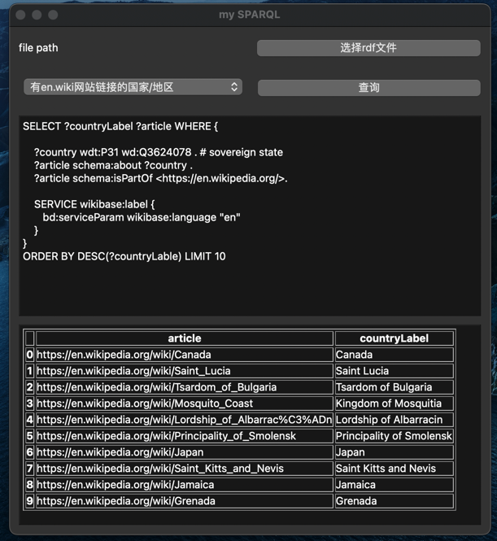

# SPARQL查询RDF文件

## 如何运行
`python3 pyqt_sqarql.py`

## 代码说明
1. 可视化部分是基于PyQt6实现的，由于我也是刚学PyQt，所以界面比较简陋，还有很大的提升空间。
2. SPARQL查询分为两个部分，一个是在线查询，调用两wikidata的查询接口，用mkwikidata库实现的，
    因为是在线查询，所以速度会比较满，一定要会科学上网才能使用；另一个是基于本地的rdf文件查询，
    查询速度就快的多。为了美观，查询的数据用pandas表格化了一下。
3. 如果有更多想了解wikidata，可以查看[wikidata官方网站](https://query.wikidata.org/)和query wikidata文档的介绍。

## 运行截图
1. 调用wikidata查询截图：

2. 本地rdf文件查询截图:

